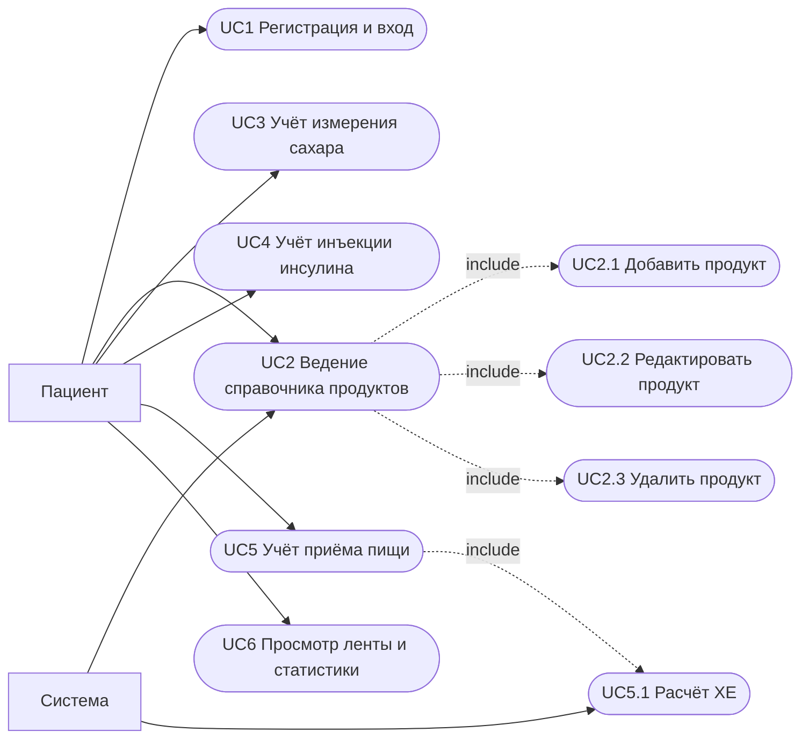

# Спецификация требований — Дневник диабетика

## 1. Бизнес-требования

**Назначение.** Веб-приложение для ведения дневника самоконтроля при сахарном
диабете: единое место для фиксации измерений глюкозы, инъекций инсулина и
приёмов пищи с автоматическим расчётом хлебных единиц (ХЕ) и срезами
«сегодня/вчера».

**Какую проблему решает.** Учёт самоконтроля при СД обычно ведётся разрозненно
(бумажные дневники, отдельные приложения для сахара/еды), из-за чего теряется
связь «съел → вколол → замерил», а расчёт ХЕ приходится считать вручную.
Система собирает эти данные в одной изолированной учётной записи пациента,
автоматически считает углеводы/ХЕ по справочнику продуктов и даёт готовый срез
для ежедневного контроля и разбора с врачом.

**Цели.**
- Обеспечить полный цикл учёта: сахар, инсулин, еда — в одном месте.
- Автоматизировать расчёт ХЕ и исключить ручной счёт углеводов.
- Гарантировать конфиденциальность и изоляцию данных каждого пациента.
- Сохранять историю неизменной (записи не «плывут» от правок справочника).
- Предоставить врачу/пациенту наглядную статистику за последние сутки.

## 2. Пользовательские требования (use case)

**Акторы.**
- *Пациент* — зарегистрированный пользователь, ведущий свой дневник.
- *Система* — secondary actor, инициирует авто-наполнение справочника при
  регистрации и авто-расчёт ХЕ при внесении приёма пищи.

| ID | Use case | Актор | Краткое описание |
|---|---|---|---|
| UC1 | Регистрация и вход | Пациент | Создаёт аккаунт по email/паролю, получает JWT-токен, входит и выходит. |
| UC2 | Ведение справочника продуктов | Пациент, Система | Видит базовый набор продуктов (создаётся системой при регистрации), добавляет/редактирует/удаляет свои продукты. |
| UC3 | Учёт измерения сахара | Пациент | Вносит замер глюкозы (ммоль/л) с временем и заметкой, редактирует/удаляет. |
| UC4 | Учёт инъекции инсулина | Пациент | Вносит инъекцию (тип короткий/длинный, доза), редактирует/удаляет. |
| UC5 | Учёт приёма пищи | Пациент, Система | Вносит съеденный продукт и граммы; система автоматически считает углеводы и ХЕ. |
| UC6 | Просмотр ленты и статистики | Пациент | Смотрит события и агрегированную статистику за сегодня и вчера. |

## 3. Функциональные требования

| ID | Требование |
|---|---|
| FR1 | Система позволяет зарегистрироваться по email и паролю; email уникален, при дубликате возвращается 409. |
| FR2 | Пароль пользователя хранится только в виде хэша bcrypt; открытый пароль нигде не сохраняется. |
| FR3 | Вход по корректным email/паролю выдаёт JWT-токен (HTTP 200); при неверных данных — 401. |
| FR4 | Все защищённые эндпоинты требуют валидный Bearer-токен; при отсутствии/невалидности/истечении — 401. |
| FR5 | Эндпоинт `/api/auth/me` возвращает данные текущего аутентифицированного пользователя. |
| FR6 | Данные изолированы по пользователю: каждый CRUD/агрегатный запрос фильтруется по `user_id` текущего пользователя; чужие записи недоступны (404). |
| FR7 | При регистрации пользователю автоматически создаётся базовый справочник из более чем 100 популярных продуктов. |
| FR8 | Система поддерживает полный CRUD над продуктами (создание, чтение списка/одного, обновление, удаление). |
| FR9 | Название продукта уникально в рамках пользователя; при конфликте имени на создание/обновление — 409. |
| FR10 | Пользователь может редактировать название и содержание углеводов любого своего продукта (в т.ч. из базового набора). |
| FR11 | Удаление продукта, уже использованного в приёмах пищи, запрещено — возвращается 409. |
| FR12 | Система поддерживает CRUD над измерениями сахара со валидацией диапазона значения (0 < value ≤ 50 ммоль/л). |
| FR13 | Система поддерживает CRUD над инъекциями инсулина с валидацией типа (`short`/`long`) и дозы (0 < dose ≤ 200 ед). |
| FR14 | При создании приёма пищи система автоматически вычисляет `carbs_grams` и `bread_units` по формуле от граммов, углеводов продукта и коэффициента ХЕ из конфигурации. |
| FR15 | Правка справочника продуктов не пересчитывает ранее созданные приёмы пищи: `carbs_grams`/`bread_units` фиксируются в момент записи (история неизменна). |
| FR16 | Списки (продукты, события) поддерживают пагинацию параметрами `skip` и `limit`. |
| FR17 | Система отдаёт ленту событий (сахар/инсулин/еда, объединённую и отсортированную по времени) за сегодня и вчера с учётом настроенного часового пояса. |
| FR18 | Система отдаёт статистику за сегодня и вчера: среднее/мин/макс сахара, суммарные дозы инсулина по типам, суммарные углеводы и ХЕ. |
| FR19 | Система предоставляет эндпоинт `/healthz` для проверки жизнеспособности сервиса. |
| FR20 | Клиентский рендеринг экранирует пользовательский ввод перед вставкой в DOM (защита от XSS). |

## 4. Нефункциональные требования

| ID | Категория | Требование |
|---|---|---|
| NFR1 | Безопасность | Пароли — только bcrypt; авторизация — JWT (HS256) с ключом из окружения; CORS ограничен конфигурацией; пользовательский ввод экранируется на клиенте. |
| NFR2 | Масштабируемость | Приложение stateless (нет сессий в памяти процесса, авторизация через JWT), что допускает горизонтальное масштабирование без общего хранилища. |
| NFR3 | Конфигурируемость / 12-факторность | Вся конфигурация (БД, порт, секрет, ХЕ, TZ, CORS) читается из переменных окружения; приложение контейнеризировано (Docker/Docker Compose). |
| NFR4 | Наблюдаемость | Логи пишутся в stdout; предусмотрен эндпоинт проверки живости `/healthz`. |
| NFR5 | Производительность | Используется пул соединений к БД с `pool_pre_ping`; списки ограничены пагинацией; для фильтров и внешних ключей заданы индексы. |
| NFR6 | Переносимость | Работа с часовыми поясами кросс-платформенна (зависимость `tzdata` для Windows/macOS/Linux); запуск воспроизводится через Docker. |