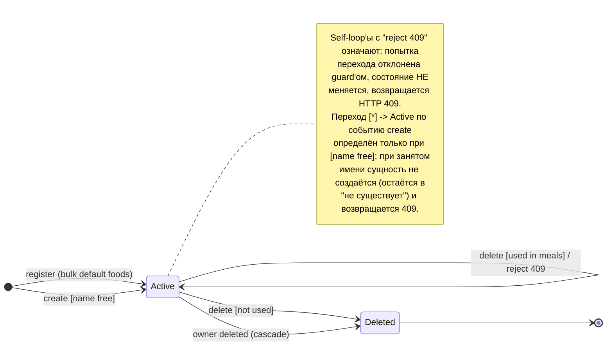

# Диаграмма состояний сущности с жизненным циклом — `Food`

## Выбор сущности и обоснование

В системе с жизненным циклом, содержащим **условия (guard'ы) на переходах**,
реализована сущность **`Food`** (продукт справочника). Остальные сущности
(`GlucoseEvent`, `InsulinEvent`, `MealEvent`, `User`) имеют только линейный
цикл «создан → удалён» без бизнес-оговорок на удалении/изменении, поэтому их
диаграммы вырождаются и не несут информации о guard-переходах, которые требует
задание.

У `Food` в существующем коде зашиты три guard'а и два входа в жизнь — это
полноценный автомат состояний, выведенный из фактической логики, а не
спроектированный «в вакууме»:

- уникальность названия в рамках пользователя (на создание и на изменение);
- запрет удаления продукта, уже использованного в приёмах пищи;
- каскадное удаление при удалении владельца;
- массовое наполнение базовым справочником при регистрации.

## Начальное и конечное состояние

- **Начальное состояние — `Active`** (продукт существует и доступен
  владельцу). В него сущность попадает одним из двух событий входа:
  одиночное создание (`create`) или пакетное наполнение базовым справочником
  при регистрации (`register`).
- **Конечное (терминальное) состояние — `Deleted`** (продукт удалён из
  справочника пользователя). Достижимо двумя событиями: явное удаление
  (`delete`, при выполнении guard'а) или каскад при удалении владельца
  (`owner deleted`). Из `Deleted` переходов нет.

## События и условия (guard'ы) на переходах

| Событие | Условие / guard | Эффект при истинном guard'е | Эффект при ложном guard'е |
|---|---|---|---|
| `register` | новый пользователь | пакетно создаёт базовые продукты → `Active` | — (вход всегда успешен для нового юзера) |
| `create` | имя свободно в рамках `user_id` | создаёт продукт → `Active` | переход не совершается, HTTP **409** |
| `update` | новое имя свободно / не конфликтует | атрибуты изменены, остаётся `Active` | HTTP **409** |
| `delete` | продукт **не** используется в `meal_events` | → `Deleted` | HTTP **409** |
| `owner deleted` | всегда (каскад FK) | → `Deleted` | — |

## Диаграмма состояний

## Таблица переходов (с трассировкой в код и требования)

| # | Текущее | Событие | Условие / guard | Следующее | Реакция при отказе | Реализация в коде | Связанное требование |
|---|---|---|---|---|---|---|---|
| T1 | — (нет) | `register` | новый пользователь | `Active` | — | `api/auth.py::register` → `crud.create_default_foods` | FR7 |
| T2 | — (нет) | `create` | имя свободно (`user_id`) | `Active` | остаётся «нет», **409** | `api/foods.py::create_food` → `crud.get_food_by_name` | FR1, FR9 |
| T3 | `Active` | `update` | новое имя свободно | `Active` (изменён) | **409** | `crud.update_food` (проверка `conflict`) | FR9, FR10 |
| T4 | `Active` | `delete` | не используется в `meal_events` | `Deleted` | **409** | `crud.delete_food` (проверка `is_used`) | FR11 |
| T5 | `Active` | `owner deleted` | всегда (каскад) | `Deleted` | — | `models.py::User.foods` `cascade="all, delete-orphan"` + FK `ondelete="CASCADE"` | FR6 |
| T6 | `Deleted` | — | терминальное | `[*]` | — | — | — |

**Пред-условие доступа (не переход состояний).** Все операции `update`/`delete`
выполняются только над существующей сущностью, принадлежащей текущему
пользователю: `crud.get_food(db, food_id, user_id)` фильтрует по паре
`(id, user_id)`. Если запись чужая или отсутствует — возвращается **404**, и
никакой переход состояний не происходит (сущность для данного пользователя
просто не найдена). Это отличают от guard'ов T3/T4: guard проверяется над
найденной своей сущностью и может отклонить легальный переход (409), тогда как
404 — отказ в доступе до всякого перехода. Трассировка: FR6.

## Пригодность диаграммы для сценарных тестов (задание 2.1)

Таблица переходов T1–T6 служит параметризуемой матрицей сценарных тестов:
каждая строка = позитивный или негативный (guard-отказ) сценарий, вызываемый
цепочкой HTTP-методов без изменения кода. Пример сквозного сценария,
покрывающего и переходы, и отказы:

1. `POST /api/auth/register` → базовые продукты в `Active` (T1).
2. `POST /api/foods/` (уникальное имя) → 201, `Active` (T2).
3. `POST /api/foods/` (то же имя) → **409** (guard T2, ложный).
4. `PATCH /api/foods/{id}` (именем другого своего продукта) → **409** (guard T3).
5. `POST /api/meal-events/` на продукт → создаёт связь «используется».
6. `DELETE /api/foods/{id}` → **409** (guard T4, продукт в приёмах пищи).
7. `DELETE /api/meal-events/{eid}` → снимает связь.
8. `DELETE /api/foods/{id}` → **204**, `Deleted` (T4 истинный).
9. Изоляция (T5/404): те же шаги под другим `user_id` → чужой продукт даёт 404
   на get/patch/delete; каскад проверяется на уровне БД после удаления владельца.

